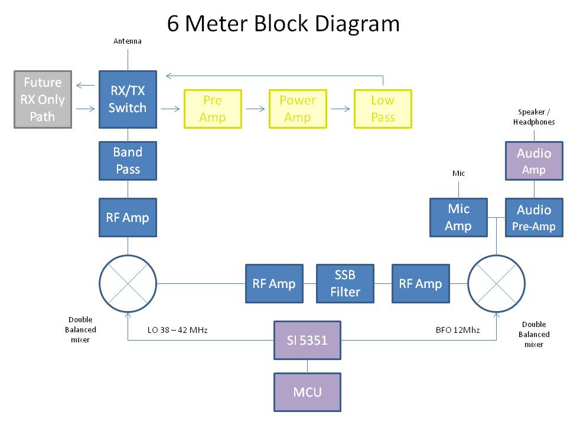

# 6_Meter_Transceiver
A homebrew transceiver for the 6 meter Ham band
 
This project is Work in progress.

 
## 2022-2-27 Status
 
This is my 6 Meter homebrew transceiver, currently work in progress.  It is a single conversion super –heterodyne design.  I constructed each stage independently with SMA connectors.  This is so I can re-make sections as needed, and will allow me in the future to swap sections to experiment with alternate designs.  The VFO and BFO are controlled using a SI5351 with an Arduino micro controller.  I currently have separate SI5351 modules for VFO and BFO because I suspected issues with cross-talk.  These issues may not actually be real, so once I am happy with the performance, I will test again with just one module to see if it is OK.  The Power Amp is still on the to-do list, so output is well under 0 DBm

The Blue boards were designed by me and ordered on-line.  The other boards I etched myself.  Construction is mostly surface mount because I find it easier than drilling all the holes.  SMD components are mostly 805 and 1206 size. Transistors are SOT23.

The Band Pass filter is a 5 coil design made with air-core inductors.

3 bi-directional termination insensitive (TIA) amps are used (blue boards).  Total RX gain is about 44db.  Total TX gain is about 16db.  Each board has its own independent RX/TX switching circuitry (mosfet based) and is fed with +12.5, GND, and RX/TX logic signal from the Arduino (3V logic and up will work)
The Mixer and modulator are both Diode Ring mixers.

The 12 MHz SSB filter is a crystal ladder filter similar to the one used in the uBitx.

The Mic and audio pre-amp (also a blue board) is made on a modified TIA amp board.  I had 10 of these boards made, and the needed circuitry was largely the same, so I modified the board with a rotary tool and jumpers.

The Audio amp is a PAM8403 module and drives a headset.  I did make some modifications to the module so it runs in-spec and to eliminate the power on audio pop.

The challenges I have been having are mostly related to spurs, splatter, carrier suppression and TX audio quality.  I have been gradually tweaking these things to improve operation before I start on a power amp.  My IF is 12 MHZ, and I was using the LSB side of the crystal filter because it is sharper (VFO 62 – 66 MHz) but have recently changed over to the USB side of the filter (VFO 38 – 42 MHz).  This eliminated the spurs I was seeing near the pass band.  I still need to make some adjustments to the crystal filter as it is too broad.

I still have some splatter and audio quality seems low, but I am starting to doubt my test setup.  I see the splatter on the RTL SDR, but I don’t see it on the Tiny SA.  The spatter happens at ~160 KHz intervals.  I am hoping to find someone local with a better spectrum analyzer to help me verify if it is the rig or my SDR dongle/test setup.

The modules to the side of the picture are my rejects/experiments.  The one covered in copper shows how I eventually will shield all the modules.  I 3D printed a cover for the board, when wrapped it with copper tape, soldered to the bottom ground plane.  The one shown is a diode ring modulator.  For some unknown reason the carrier suppression is rather poor.  I had previously made a junk-box modulator that had much better carrier suppression.  I don’t know why it is better than the one I more carefully made for the radio, but until I figure it out, I am using the junk box version.  The junk box modulator uses unmatched schottkey diodes, whereas the “final” one uses a 4 diode SMD package because I wanted them matched – I thought this would be better, but maybe not.

